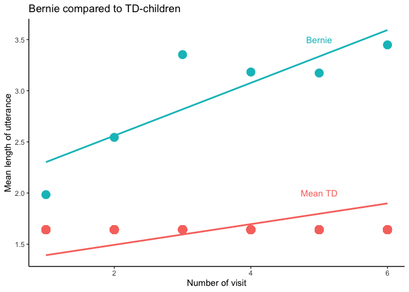

Welcome to the second exciting part of the Language Development in ASD exercise
-------------------------------------------------------------------------------

In this exercise we will delve more in depth with different practices of model comparison and model selection, by first evaluating your models from last time against some new data. Does the model generalize well? Then we will learn to do better by cross-validating models and systematically compare them.

The questions to be answered (in a separate document) are: 1- Discuss the differences in performance of your model in training and testing data 2- Which individual differences should be included in a model that maximizes your ability to explain/predict new data? 3- Predict a new kid's performance (Bernie) and discuss it against expected performance of the two groups

Learning objectives
-------------------

-   Critically appraise the predictive framework (contrasted to the explanatory framework)
-   Learn the basics of machine learning workflows: training/testing, cross-validation, feature selections

Let's go
--------

N.B. There are several datasets for this exercise, so pay attention to which one you are using!

1.  The (training) dataset from last time (the awesome one you produced :-) ).
2.  The (test) datasets on which you can test the models from last time:

-   Demographic and clinical data: <https://www.dropbox.com/s/ra99bdvm6fzay3g/demo_test.csv?dl=1>
-   Utterance Length data: <https://www.dropbox.com/s/uxtqqzl18nwxowq/LU_test.csv?dl=1>
-   Word data: <https://www.dropbox.com/s/1ces4hv8kh0stov/token_test.csv?dl=1>

### Exercise 1) Testing model performance

How did your models from last time perform? In this exercise you have to compare the results on the training data () and on the test data. Report both of them. Compare them. Discuss why they are different.

-   recreate the models you chose last time (just write the model code again and apply it to your training data (from the first assignment))
-   calculate performance of the model on the training data: root mean square error is a good measure. (Tip: google the function rmse())
-   create the test dataset (apply the code from assignment 1 to clean up the 3 test datasets)
-   test the performance of the models on the test data (Tips: google the functions "predict()")
-   optional: predictions are never certain, can you identify the uncertainty of the predictions? (e.g. google predictinterval())

Part 1
======

``` r
# Load training Data
LU_train <- read.csv("LU_train.csv")
LU_test <- read.csv("LU_test.csv")
demo_train <- read.csv("demo_train.csv")
demo_test <- read.csv("demo_test.csv")
token_train <- read.csv("token_train.csv")
token_test <- read.csv("token_test.csv")


# Cleanup data
train_data <- CleanUpData(demo_train, token_train, LU_train)
test_data <- CleanUpData(demo_test, token_test, LU_test)

# Add visit^2
train_data$Visit2 <- train_data$Visit^2 
test_data$Visit2 <- test_data$Visit^2 

# Remove NAs
train_data <- subset(train_data, !is.na(CHI_MLU))
test_data <- subset(test_data, !is.na(CHI_MLU))


# Null model
null <- lmer(CHI_MLU ~ Visit + Diagnosis + (1 | Child.ID) + (1 + Visit | Child.ID), data=train_data)
```

    ## Warning in checkConv(attr(opt, "derivs"), opt$par, ctrl =
    ## control$checkConv, : unable to evaluate scaled gradient

    ## Warning in checkConv(attr(opt, "derivs"), opt$par, ctrl =
    ## control$checkConv, : Model failed to converge: degenerate Hessian with 1
    ## negative eigenvalues

    ## Warning: Model failed to converge with 1 negative eigenvalue: -4.1e-03

``` r
summary(null)
```

    ## Linear mixed model fit by REML. t-tests use Satterthwaite's method [
    ## lmerModLmerTest]
    ## Formula: 
    ## CHI_MLU ~ Visit + Diagnosis + (1 | Child.ID) + (1 + Visit | Child.ID)
    ##    Data: train_data
    ## 
    ## REML criterion at convergence: 602.2
    ## 
    ## Scaled residuals: 
    ##      Min       1Q   Median       3Q      Max 
    ## -2.46271 -0.56912 -0.08732  0.42215  2.70430 
    ## 
    ## Random effects:
    ##  Groups     Name        Variance Std.Dev. Corr 
    ##  Child.ID   (Intercept) 0.2332   0.4829        
    ##  Child.ID.1 (Intercept) 0.1356   0.3683        
    ##             Visit       0.0275   0.1658   -0.67
    ##  Residual               0.1613   0.4016        
    ## Number of obs: 352, groups:  Child.ID, 61
    ## 
    ## Fixed effects:
    ##              Estimate Std. Error       df t value Pr(>|t|)    
    ## (Intercept)   1.03831    0.12236 59.90865   8.486 7.39e-12 ***
    ## Visit         0.23353    0.02475 59.78969   9.437 1.89e-13 ***
    ## DiagnosisASD  0.29042    0.15435 58.14226   1.882   0.0649 .  
    ## ---
    ## Signif. codes:  0 '***' 0.001 '**' 0.01 '*' 0.05 '.' 0.1 ' ' 1
    ## 
    ## Correlation of Fixed Effects:
    ##             (Intr) Visit 
    ## Visit       -0.405       
    ## DiagnossASD -0.662  0.000
    ## convergence code: 0
    ## unable to evaluate scaled gradient
    ## Model failed to converge: degenerate  Hessian with 1 negative eigenvalues

``` r
#- recreate the models you chose last time (just write the code again and apply it to Train Data)
model4 <- lmer(CHI_MLU ~ Diagnosis * verbalIQ1 * (Visit + Visit2) + (1 + Visit + Visit2 | Child.ID), data = train_data)
```

    ## Warning in checkConv(attr(opt, "derivs"), opt$par, ctrl =
    ## control$checkConv, : Model failed to converge with max|grad| = 0.0313095
    ## (tol = 0.002, component 1)

``` r
summary(model4)
```

    ## Linear mixed model fit by REML. t-tests use Satterthwaite's method [
    ## lmerModLmerTest]
    ## Formula: 
    ## CHI_MLU ~ Diagnosis * verbalIQ1 * (Visit + Visit2) + (1 + Visit +  
    ##     Visit2 | Child.ID)
    ##    Data: train_data
    ## 
    ## REML criterion at convergence: 494.2
    ## 
    ## Scaled residuals: 
    ##     Min      1Q  Median      3Q     Max 
    ## -2.6365 -0.5395 -0.0388  0.4497  3.2174 
    ## 
    ## Random effects:
    ##  Groups   Name        Variance  Std.Dev. Corr       
    ##  Child.ID (Intercept) 0.0472468 0.21736             
    ##           Visit       0.0533123 0.23089  -0.24      
    ##           Visit2      0.0009169 0.03028  -0.20 -0.90
    ##  Residual             0.1192993 0.34540             
    ## Number of obs: 352, groups:  Child.ID, 61
    ## 
    ## Fixed effects:
    ##                                Estimate Std. Error        df t value
    ## (Intercept)                    0.683006   0.316585 64.303144   2.157
    ## DiagnosisASD                  -0.202018   0.576368 63.436476  -0.351
    ## verbalIQ1                      0.021753   0.016775 63.448352   1.297
    ## Visit                         -0.431913   0.226464 62.253103  -1.907
    ## Visit2                         0.052160   0.031243 61.508717   1.669
    ## DiagnosisASD:verbalIQ1        -0.019213   0.028593 63.482182  -0.672
    ## DiagnosisASD:Visit             0.213127   0.412974 61.839030   0.516
    ## DiagnosisASD:Visit2            0.065975   0.057211 61.564744   1.153
    ## verbalIQ1:Visit                0.041443   0.011942 60.534834   3.470
    ## verbalIQ1:Visit2              -0.004549   0.001646 59.728148  -2.763
    ## DiagnosisASD:verbalIQ1:Visit   0.007786   0.020487 61.893308   0.380
    ## DiagnosisASD:verbalIQ1:Visit2 -0.004316   0.002840 61.752243  -1.520
    ##                               Pr(>|t|)    
    ## (Intercept)                   0.034716 *  
    ## DiagnosisASD                  0.727123    
    ## verbalIQ1                     0.199425    
    ## Visit                         0.061111 .  
    ## Visit2                        0.100102    
    ## DiagnosisASD:verbalIQ1        0.504052    
    ## DiagnosisASD:Visit            0.607640    
    ## DiagnosisASD:Visit2           0.253291    
    ## verbalIQ1:Visit               0.000965 ***
    ## verbalIQ1:Visit2              0.007592 ** 
    ## DiagnosisASD:verbalIQ1:Visit  0.705199    
    ## DiagnosisASD:verbalIQ1:Visit2 0.133733    
    ## ---
    ## Signif. codes:  0 '***' 0.001 '**' 0.01 '*' 0.05 '.' 0.1 ' ' 1
    ## 
    ## Correlation of Fixed Effects:
    ##             (Intr) DgnASD vrbIQ1 Visit  Visit2 DgASD:IQ1 DgASD:V DASD:V2
    ## DiagnossASD -0.549                                                      
    ## verbalIQ1   -0.922  0.506                                               
    ## Visit       -0.805  0.442  0.739                                        
    ## Visit2       0.684 -0.376 -0.626 -0.961                                 
    ## DgnsASD:IQ1  0.541 -0.953 -0.587 -0.434  0.367                          
    ## DgnssASD:Vs  0.442 -0.805 -0.405 -0.548  0.527  0.767                   
    ## DgnssASD:V2 -0.374  0.684  0.342  0.525 -0.546 -0.652    -0.961         
    ## vrblIQ1:Vst  0.743 -0.408 -0.802 -0.922  0.885  0.470     0.505  -0.484 
    ## vrblIQ1:Vs2 -0.630  0.346  0.678  0.886 -0.922 -0.398    -0.486   0.503 
    ## DgASD:IQ1:V -0.433  0.767  0.467  0.537 -0.516 -0.804    -0.954   0.917 
    ## DASD:IQ1:V2  0.365 -0.652 -0.393 -0.514  0.534  0.683     0.917  -0.954 
    ##             vrIQ1:V vIQ1:V2 DgASD:IQ1:V
    ## DiagnossASD                            
    ## verbalIQ1                              
    ## Visit                                  
    ## Visit2                                 
    ## DgnsASD:IQ1                            
    ## DgnssASD:Vs                            
    ## DgnssASD:V2                            
    ## vrblIQ1:Vst                            
    ## vrblIQ1:Vs2 -0.961                     
    ## DgASD:IQ1:V -0.583   0.560             
    ## DASD:IQ1:V2  0.557  -0.580  -0.961     
    ## convergence code: 0
    ## Model failed to converge with max|grad| = 0.0313095 (tol = 0.002, component 1)

``` r
model5 <- lmer(CHI_MLU ~ Diagnosis + verbalIQ1 + Visit + Visit2 + Diagnosis:verbalIQ1 + Diagnosis:Visit +  verbalIQ1:Visit + verbalIQ1:Visit2 + Diagnosis:verbalIQ1:Visit + (1 + Visit + Visit2 | Child.ID), data = train_data)
```

    ## Warning in checkConv(attr(opt, "derivs"), opt$par, ctrl =
    ## control$checkConv, : unable to evaluate scaled gradient

    ## Warning in checkConv(attr(opt, "derivs"), opt$par, ctrl =
    ## control$checkConv, : Model failed to converge: degenerate Hessian with 1
    ## negative eigenvalues

    ## Warning: Model failed to converge with 1 negative eigenvalue: -2.3e+00

``` r
summary(model5)
```

    ## Linear mixed model fit by REML. t-tests use Satterthwaite's method [
    ## lmerModLmerTest]
    ## Formula: 
    ## CHI_MLU ~ Diagnosis + verbalIQ1 + Visit + Visit2 + Diagnosis:verbalIQ1 +  
    ##     Diagnosis:Visit + verbalIQ1:Visit + verbalIQ1:Visit2 + Diagnosis:verbalIQ1:Visit +  
    ##     (1 + Visit + Visit2 | Child.ID)
    ##    Data: train_data
    ## 
    ## REML criterion at convergence: 481.2
    ## 
    ## Scaled residuals: 
    ##     Min      1Q  Median      3Q     Max 
    ## -2.6280 -0.5553 -0.0658  0.4649  3.2451 
    ## 
    ## Random effects:
    ##  Groups   Name        Variance  Std.Dev. Corr       
    ##  Child.ID (Intercept) 0.0431245 0.20766             
    ##           Visit       0.0561458 0.23695  -0.24      
    ##           Visit2      0.0009969 0.03157  -0.18 -0.91
    ##  Residual             0.1195765 0.34580             
    ## Number of obs: 352, groups:  Child.ID, 61
    ## 
    ## Fixed effects:
    ##                                Estimate Std. Error         df t value
    ## (Intercept)                    0.829368   0.292505 166.785714   2.835
    ## DiagnosisASD                  -0.647995   0.419115  59.647832  -1.546
    ## verbalIQ1                      0.010113   0.015262 158.903025   0.663
    ## Visit                         -0.581778   0.193848 128.144695  -3.001
    ## Visit2                         0.073705   0.026404  87.377257   2.791
    ## DiagnosisASD:verbalIQ1         0.009962   0.020824  60.032304   0.478
    ## DiagnosisASD:Visit             0.669161   0.114017  56.588095   5.869
    ## verbalIQ1:Visit                0.053353   0.009805 131.159560   5.441
    ## verbalIQ1:Visit2              -0.006262   0.001327  87.255539  -4.718
    ## DiagnosisASD:verbalIQ1:Visit  -0.022033   0.005661  56.769556  -3.892
    ##                              Pr(>|t|)    
    ## (Intercept)                  0.005143 ** 
    ## DiagnosisASD                 0.127369    
    ## verbalIQ1                    0.508498    
    ## Visit                        0.003233 ** 
    ## Visit2                       0.006443 ** 
    ## DiagnosisASD:verbalIQ1       0.634116    
    ## DiagnosisASD:Visit           2.41e-07 ***
    ## verbalIQ1:Visit              2.51e-07 ***
    ## verbalIQ1:Visit2             8.97e-06 ***
    ## DiagnosisASD:verbalIQ1:Visit 0.000264 ***
    ## ---
    ## Signif. codes:  0 '***' 0.001 '**' 0.01 '*' 0.05 '.' 0.1 ' ' 1
    ## 
    ## Correlation of Fixed Effects:
    ##             (Intr) DgnASD vrbIQ1 Visit  Visit2 DgASD:IQ1 DASD:V vrIQ1:V
    ## DiagnossASD -0.435                                                     
    ## verbalIQ1   -0.930  0.410                                              
    ## Visit       -0.771  0.134  0.708                                       
    ## Visit2       0.617 -0.004 -0.562 -0.947                                
    ## DgnsASD:IQ1  0.430 -0.953 -0.478 -0.132  0.003                         
    ## DgnssASD:Vs  0.323 -0.733 -0.306 -0.186  0.010  0.699                  
    ## vrblIQ1:Vst  0.730 -0.130 -0.759 -0.944  0.891  0.151     0.181        
    ## vrblIQ1:Vs2 -0.583  0.004  0.592  0.897 -0.947 -0.004    -0.011 -0.941 
    ## DgASD:IQ1:V -0.321  0.700  0.357  0.184 -0.011 -0.734    -0.953 -0.212 
    ##             vIQ1:V2
    ## DiagnossASD        
    ## verbalIQ1          
    ## Visit              
    ## Visit2             
    ## DgnsASD:IQ1        
    ## DgnssASD:Vs        
    ## vrblIQ1:Vst        
    ## vrblIQ1:Vs2        
    ## DgASD:IQ1:V  0.014 
    ## convergence code: 0
    ## unable to evaluate scaled gradient
    ## Model failed to converge: degenerate  Hessian with 1 negative eigenvalues

``` r
#- calculate performance of the model on the training data: root mean square error is a good measure. (Tip: google the function rmse())
rmse(predict(model4), train_data$CHI_MLU) # 0.303
```

    ## [1] 0.2968337

``` r
rmse(predict(model5), train_data$CHI_MLU) #0.303
```

    ## [1] 0.2979779

``` r
#- test the performance of the models on the test data (Tips: google the functions "predict()")
predictions <- predict(model4, test_data)
rmse(predictions,test_data$CHI_MLU)
```

    ## [1] 0.6778492

``` r
predictions2 <- predict(model5, test_data)
rmse(predictions2,test_data$CHI_MLU)
```

    ## [1] 0.6872557

``` r
predictions_null <- predict(null, test_data)
rmse(predictions_null,test_data$CHI_MLU)
```

    ## [1] 1.45377

``` r
#- optional: predictions are never certain, can you identify the uncertainty of the predictions? (e.g. google predictinterval())

predictInterval(model4, test_data, n.sims=500, level=0.9, stat="median")
```

    ##          fit      upr       lwr
    ## 1  1.2628429 1.926162 0.5841127
    ## 2  1.5598149 2.300076 0.8846474
    ## 3  1.6840890 2.379705 1.0172758
    ## 4  1.7270732 2.365108 1.1137872
    ## 5  1.7798379 2.459114 1.0790103
    ## 6  2.3236622 2.937802 1.7420447
    ## 7  3.0486976 3.679459 2.4419726
    ## 8  3.5940352 4.269929 2.8856114
    ## 9  3.8397582 4.554251 3.2036784
    ## 10 3.8049509 4.483276 3.0871510
    ## 11 3.5800717 4.299315 2.8181678
    ## 12 1.6089643 2.159931 0.9708085
    ## 13 1.9693454 2.629596 1.4119889
    ## 14 2.2327099 2.895425 1.7000267
    ## 15 2.3149088 2.935647 1.6415271
    ## 16 2.2796925 2.954277 1.5690793
    ## 17 2.1110415 2.815868 1.4337669
    ## 18 1.2804022 1.915049 0.6798222
    ## 19 2.0327271 2.678608 1.3542571
    ## 20 2.5925691 3.228826 1.9802813
    ## 21 3.0805841 3.696535 2.4065818
    ## 22 3.3759162 4.058279 2.7063563
    ## 23 3.6005754 4.309999 2.8475630
    ## 24 0.9031270 1.554993 0.2150293
    ## 25 1.3212619 1.940438 0.6370155
    ## 26 1.7108922 2.299551 1.0395201
    ## 27 2.1279803 2.768022 1.4812343
    ## 28 2.5782003 3.239427 1.9135310
    ## 29 2.9966051 3.716245 2.2704640
    ## 30 0.9241381 1.535716 0.2320218
    ## 31 1.3917618 2.052686 0.6799324
    ## 32 1.8099173 2.478309 1.1487523
    ## 33 2.2223342 2.814650 1.5540111
    ## 34 2.5429074 3.239162 1.8983853
    ## 35 2.9148936 3.606637 2.2210572

\[HERE GOES YOUR ANSWER\]

### Exercise 2) Model Selection via Cross-validation (N.B: ChildMLU!)

One way to reduce bad surprises when testing a model on new data is to train the model via cross-validation.

In this exercise you have to use cross-validation to calculate the predictive error of your models and use this predictive error to select the best possible model.

-   Use cross-validation to compare your model from last week with the basic model (Child MLU as a function of Time and Diagnosis, and don't forget the random effects!)
-   (Tips): google the function "createFolds"; loop through each fold, train both models on the other folds and test them on the fold)

-   Now try to find the best possible predictive model of ChildMLU, that is, the one that produces the best cross-validated results.

-   Bonus Question 1: What is the effect of changing the number of folds? Can you plot RMSE as a function of number of folds?
-   Bonus Question 2: compare the cross-validated predictive error against the actual predictive error on the test wwaq

``` r
#- Create the basic model of ChildMLU as a function of Time and Diagnosis (don't forget the random effects!).
# Already defined earlier

#- Make a cross-validated version of the model. (Tips: google the function "createFolds";  loop through each fold, train a model on the other folds and test it on the fold)
folds <- fold(train_data, k = 5, id_col = "Child.ID")
rmse_list <- c() # creating an empty list for rmse-values

# creating a for-loop and crossvalidation our 'best' model
for(i in 1:5){
  total_train <- filter(folds, .folds != i)
  total_test <- filter(folds, .folds == i)
  
  model <- lmer(CHI_MLU ~ 1 + Diagnosis * verbalIQ1 * (Visit +  Visit2) + (1 + Visit + Visit2 | Child.ID), total_train, REML=FALSE)
  
  rmse_list <- c(rmse_list,rmse(total_test$CHI_MLU, predict(model, total_test, allow.new.levels = T)))
}
```

    ## Warning in checkConv(attr(opt, "derivs"), opt$par, ctrl =
    ## control$checkConv, : Model failed to converge with max|grad| = 0.124061
    ## (tol = 0.002, component 1)

    ## boundary (singular) fit: see ?isSingular
    ## boundary (singular) fit: see ?isSingular

    ## Warning in checkConv(attr(opt, "derivs"), opt$par, ctrl =
    ## control$checkConv, : Model failed to converge with max|grad| = 0.432599
    ## (tol = 0.002, component 1)

    ## Warning in checkConv(attr(opt, "derivs"), opt$par, ctrl =
    ## control$checkConv, : Model failed to converge with max|grad| = 0.104066
    ## (tol = 0.002, component 1)

``` r
mean(rmse_list)
```

    ## [1] 0.5407698

``` r
 # Trying CVMS package 
# cv <- fold(train_data, k = 5, cat_col = 'Diagnosis', id_col = 'Child.ID') %>% cross_validate(null, folds_col # = '.folds',family='gaussian', REML = FALSE)

#- Report the results and comment on them. 
# Cross validation highly improves prediction error

#- Now try to find the best possible predictive model of ChildMLU, that is, the one that produces the best cross-validated results.
# Trying the more complicated model5
rmse_list_model5 <- c() # creating an empty list for rmse-values

# creating a for-loop
for(i in 1:5){
  total_train_model5 <- filter(folds, .folds != i)
  total_test_model5 <- filter(folds, .folds == i)
  
  model <- lmer(CHI_MLU ~ Diagnosis + verbalIQ1 + Visit + Visit2 + Diagnosis:verbalIQ1 + Diagnosis:Visit +  verbalIQ1:Visit + verbalIQ1:Visit2 + Diagnosis:verbalIQ1:Visit + (1 + Visit + Visit2 | Child.ID), data = total_train_model5, REML=FALSE)
  
  rmse_list_model5 <- c(rmse_list_model5, rmse(total_test_model5$CHI_MLU, predict(model, total_test_model5, allow.new.levels = T)))
}
```

    ## Warning in checkConv(attr(opt, "derivs"), opt$par, ctrl =
    ## control$checkConv, : Model failed to converge with max|grad| = 0.037686
    ## (tol = 0.002, component 1)

    ## Warning in checkConv(attr(opt, "derivs"), opt$par, ctrl =
    ## control$checkConv, : Model failed to converge with max|grad| = 0.0894421
    ## (tol = 0.002, component 1)

    ## boundary (singular) fit: see ?isSingular

    ## Warning: Model failed to converge with 2 negative eigenvalues: -1.8e-02
    ## -2.1e+02

    ## boundary (singular) fit: see ?isSingular

    ## Warning in checkConv(attr(opt, "derivs"), opt$par, ctrl =
    ## control$checkConv, : Model failed to converge with max|grad| = 0.0259485
    ## (tol = 0.002, component 1)

``` r
mean(rmse_list_model5)
```

    ## [1] 0.5413411

``` r
# Bonus Question 1: What is the effect of changing the number of folds? Can you plot RMSE as a function of number of folds?
# Bonus Question 2: compare the cross-validated predictive error against the actual predictive error on the test data
```

\[HERE GOES YOUR ANSWER\] When assessing the out-of-sample prediction error of various models via K-fold cross-validation model 4 and model 5 turn out to be the best models (very similar). These can then be tested on the test\_data.

### Exercise 3) Assessing the single child

Let's get to business. This new kiddo - Bernie - has entered your clinic. This child has to be assessed according to his group's average and his expected development.

Bernie is one of the six kids in the test dataset, so make sure to extract that child alone for the following analysis.

You want to evaluate:

-   how does the child fare in ChildMLU compared to the average TD child at each visit? Define the distance in terms of absolute difference between this Child and the average TD.

-   how does the child fare compared to the model predictions at Visit 6? Is the child below or above expectations? (tip: use the predict() function on Bernie's data only and compare the prediction with the actual performance of the child)

``` r
# Filtering out Bernie-boy
bernie <- test_data %>% filter(Child.ID==2)

# Filter all td kids and calculate mean MLU for each visit
visit_td_CHI_MLU <- train_data %>% filter(Diagnosis=='TD') %>% group_by(Visit) %>% summarise(mean=mean(CHI_MLU))
visit_td_CHI_MLU
```

    ## # A tibble: 6 x 2
    ##   Visit  mean
    ##   <dbl> <dbl>
    ## 1     1  1.30
    ## 2     2  1.44
    ## 3     3  1.77
    ## 4     4  1.86
    ## 5     5  1.60
    ## 6     6  1.89

``` r
# Add SternBern
visit_td_CHI_MLU$bernie <- bernie$CHI_MLU

# Calculate diference
visit_td_CHI_MLU$difference <- visit_td_CHI_MLU$bernie-visit_td_CHI_MLU$mean
visit_td_CHI_MLU$difference # Bernie performs muuuch better
```

    ## [1] 0.6799798 1.1007610 1.5825561 1.3243901 1.5747398 1.5565052

``` r
# Plotting difference
bernie <- test_data %>% 
  filter(Child.ID == 2)
onlyTD <- train_data %>% 
  filter(Diagnosis == "TD")

ggplot()+
  geom_point(data = onlyTD, aes(x = Visit, y= mean(CHI_MLU), group = Visit, color = "Blue", size=10))+
  geom_smooth(data = onlyTD, aes(x = Visit, y = CHI_MLU, color = "Blue"), method = lm, se=FALSE)+
  geom_point(data = bernie, aes(x = Visit, y = CHI_MLU, group = Visit, color = "Red", size = 10))+
  geom_smooth(data = bernie, aes(x = Visit, y = CHI_MLU, color = "Red"), method = lm, se=FALSE)+
  theme_classic()+
  labs(title = "Bernie compared to TD-children", x = "Number of visit", y = "Mean length of utterance")+
  theme(legend.position="none")+
  geom_text(aes(x = 5, y = 3.5, label = "Bernie", color = "Red"))+
  geom_text(aes(x = 5, y = 2, label = "Mean TD", color = "Blue"))
```



``` r
# See how well Bernie is predicted by the model
predictions_bernie <- predict(model4, bernie)
rmse(predictions_bernie,bernie$CHI_MLU)
```

    ## [1] 0.4737798

\[HERE GOES YOUR ANSWER\]

### OPTIONAL: Exercise 4) Model Selection via Information Criteria

Another way to reduce the bad surprises when testing a model on new data is to pay close attention to the relative information criteria between the models you are comparing. Let's learn how to do that!

Re-create a selection of possible models explaining ChildMLU (the ones you tested for exercise 2, but now trained on the full dataset and not cross-validated).

Then try to find the best possible predictive model of ChildMLU, that is, the one that produces the lowest information criterion.

-   Bonus question for the optional exercise: are information criteria correlated with cross-validated RMSE? That is, if you take AIC for Model 1, Model 2 and Model 3, do they co-vary with their cross-validated RMSE?

### OPTIONAL: Exercise 5): Using Lasso for model selection

Welcome to the last secret exercise. If you have already solved the previous exercises, and still there's not enough for you, you can expand your expertise by learning about penalizations. Check out this tutorial: <http://machinelearningmastery.com/penalized-regression-in-r/> and make sure to google what penalization is, with a focus on L1 and L2-norms. Then try them on your data!
